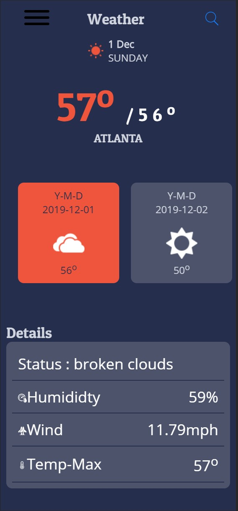
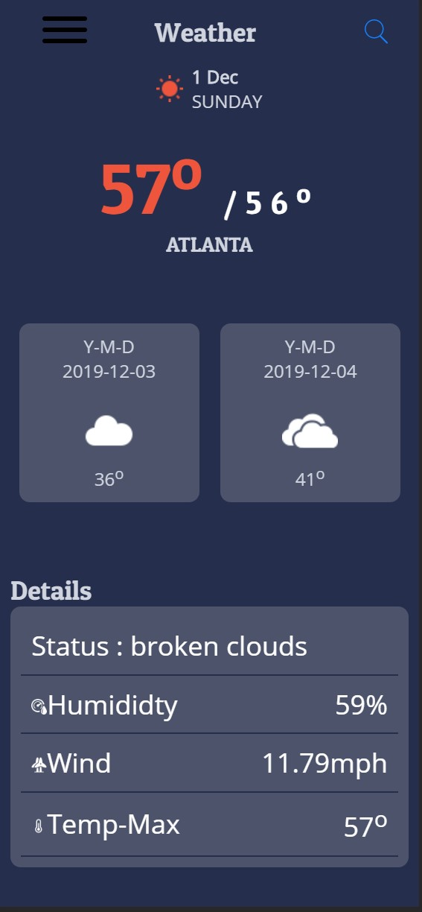
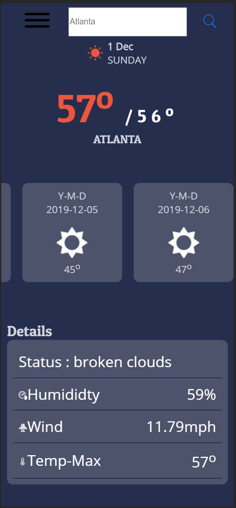

# Weather-App
### Main window

### Scrollable Preview of the week

### Searching a new location

### Resources

[Icons8](https://icons8.com/).

[Dribble](https://dribbble.com/shots/7994073-Weather-App-Design/attachments/526038?mode=media).

Must sign up for API Access at [Open Weather Map](https://openweathermap.org).

### Platform

[React js](https://reactjs.org/docs/getting-started.html).

## Goal of prject

- To Pull Data from the weather **API** and display it to the user.
- Allow User to type a location, country or state only and search that area for weather updates.
- Pull and filter forcast data from response, and display each day

# How to use

- Simply download repo.
- Load the build folder into a project workspace.
- Run **index.html** on a live server.
- To search click the search icon
  - Type countries, or states only, does not accept zip or full address format
- Click the search icon once more to search that location and see display update

I use [VS Code](https://code.visualstudio.com/download), and added the [live server](https://marketplace.visualstudio.com/items?itemName=ritwickdey.LiveServer) extention

# To Do

- [x] ~~Add Weather Image to the Display~~
- add a menu to the app
  - Control color _maybe_
  - Control details section
- [x] ~~Fix bugs after upload~~

# Issues

- [x] Whenever I added the requireed code that pulls the necessary images based on the API icon response, I get a module not found error.

- [ ] Repo breakes after upload
